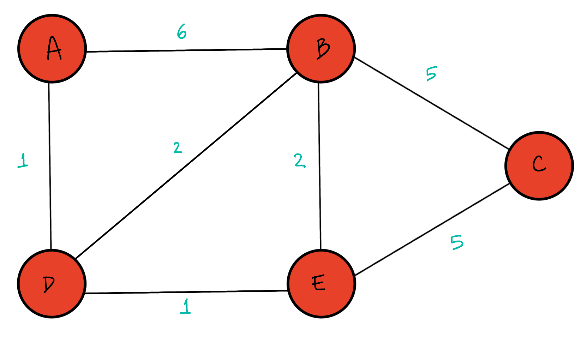
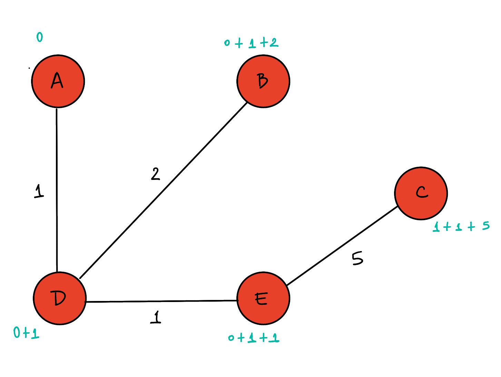
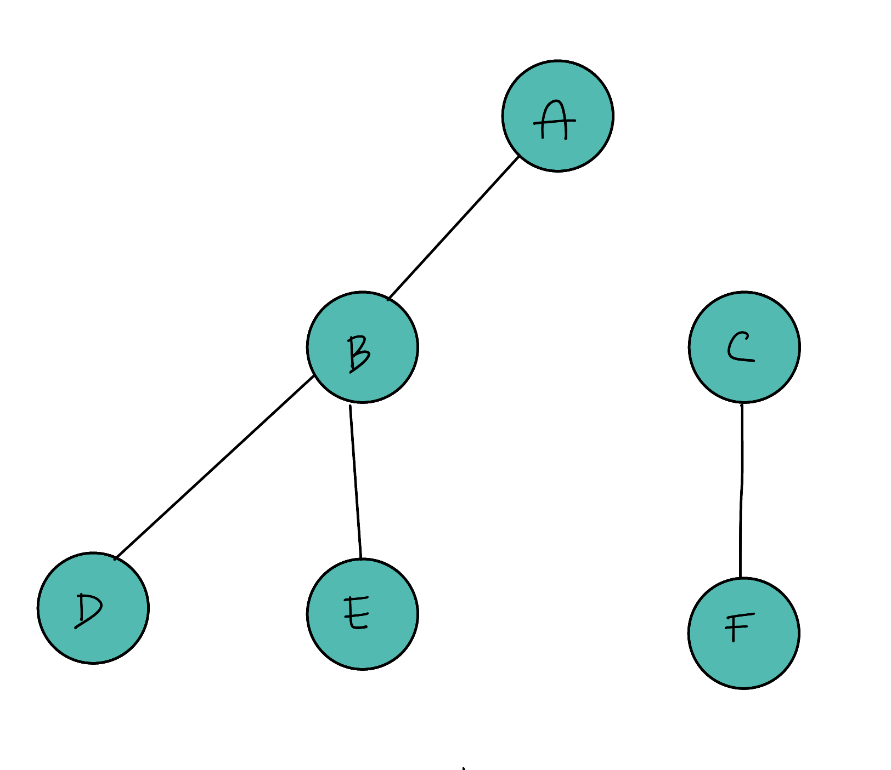
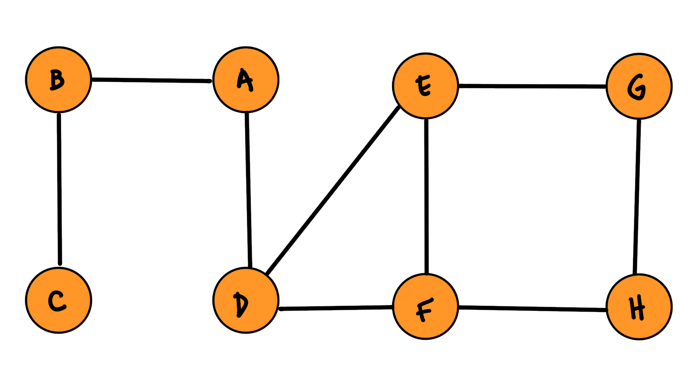
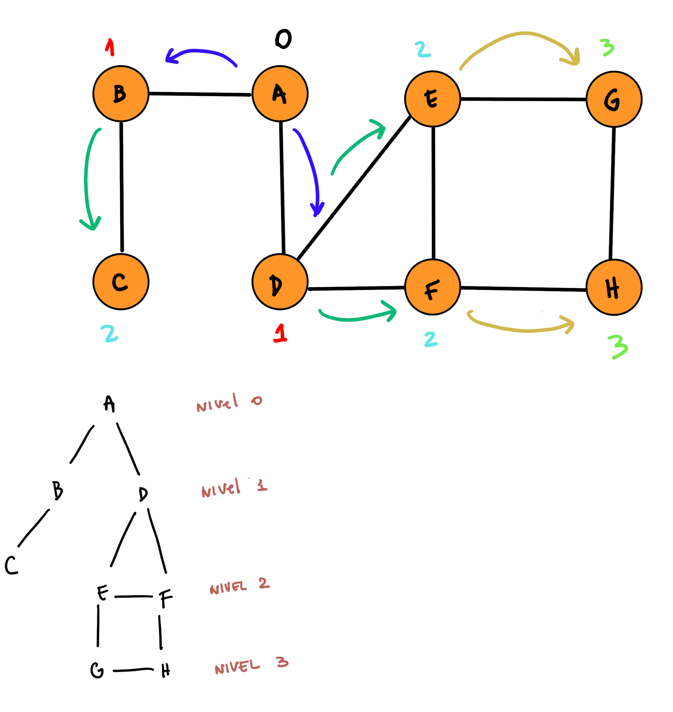

# TPO Programación III

## Algoritmos

- [Dijkstra](dijkstra.py).
- [Depth First Search](dfs.py).
- [Breadth First Search](bfs.py).

Para realizar este trabajo comencé creando un archivo llamado [estructuras.py](estructuras.py) donde se encuentran las clases [Grafo](estructuras.py#L3) y [DiccionarioPrioridad](estructuras.py#L58), que son de tipo dinámicas. La clase [Grafo](estructuras.py#L3) fue necesaria para la implementación de todos los algoritmos elegidos. Para la implementación de [Dijkstra](dijkstra.py) también se utilizó [DiccionarioPrioridad](estructuras.py#L58).

### Dijkstra

#### Ejecución
```console
python dijkstra.py
```

#### Implementación

 El método [run](dijkstra.py#L6) implementa al algoritmo. Tiene como parámetros un [Grafo](estructuras.py#L3) `g` y un vértice origen `vertice_origen`.

- Empezamos inicializando un diccionario `solucion` donde se devolverá la misma. 
  ```python 
    solucion = {}
  ``` 
- Inicializamos `vertices_no_visitados`, el cual es un [DiccionarioPrioridad](estructuras.py#L58). En un [DiccionarioPrioridad](estructuras.py#L58) el valor de cada clave representa su prioridad. Las prioridades son mas importantes cuanto mas chicas sean, es decir que una prioridad 1 tiene mas importancia que una prioridad 2. En un [DiccionarioPrioridad](estructuras.py#L58) la clave con prioridad mas importante siempre es la **primera** del diccionario. En el caso de `vertices_no_visitados`, cada clave representa un vértice de `g` y cada prioridad representa la distancia mínima desde el `vertice_origen` hacia el vértice en cuestión.
```python 
    # Ejemplo: si vertice_origen es A, la distancia minima hacia si mismo es 0.
    vertices_no_visitados['A'] = 0
 ``` 
- El diccionario `solucion` tendrá como claves todos los vértices de `g` y cada clave tendrá como valor otro diccionario con las claves `distancia` y `vertice_anterior`. `distancia` tendrá como valor la distancia mínima desde el `vertice_origen` hacia el vértice en cuestión y `vertice_anterior` tendrá como valor el vértice anterior al vértice en cuestión (lo cual servirá para reconstruir el camino mas corto a cualquier vértice desde el `vertice_origen`). Ya que al comienzo no conocemos las distancias mínimas desde el `vertice_origen` hacia el resto de los vértices, las tomamos como infinitas:
```python 
    for vertice in g.vertices():
        vertices_no_visitados[vertice] = math.inf
        solucion[vertice] = {'distancia':math.inf, 'vertice_anterior':None}
``` 
- Como sabemos que la distancia desde el `vertice_origen` hacia si mismo es 0, lo indicamos en `solucion` y en `vertices_no_visitados`:
```python 
    solucion[vertice_origen]['distancia'] = 0
    vertices_no_visitados[vertice_origen] = 0
``` 
- Mientras el diccionario `vertices_no_visitados` tenga elementos, tomamos y eliminamos el primero con el metodo [pop](estructuras.py#L69) (el cual devuelve el vértice `vertice` y la distancia mínima desde el `vertice_origen` hacia `vertice` recorrida hasta el momento, la cual guardamos en `distancia_recorrida`):
```python 
    while len(vertices_no_visitados) > 0:
        distancia_recorrida, vertice = vertices_no_visitados.pop()
``` 
- Luego obtenemos los vértices adyacentes al vértice `vertice`:
```python 
    adyacentes = g.adyacentes(vertice)
``` 
- Recorremos los vértices adyacentes, para cada uno obtenemos la distancia desde el vértice `vertice` hacia el vértice `adyacente` y la guardamos en `distancia_adyacente`:
```python 
    for adyacente in adyacentes:
        distancia_adyacente = g.peso_arista(vertice, adyacente)
``` 
- Calculamos la distancia desde el `vertice_origen` hacia el vértice `adyacente` y la guardamos en `distancia_desde_origen`:
```python 
    distancia_desde_origen = distancia_recorrida + distancia_adyacente
```
- Si la `distancia_desde_origen` es menor a la distancia previamente calculada para ese vértice `solucion[adyacente]['distancia']`, actualizamos la `solucion` y `vertices_no_visitados`:
```python 
    solucion[adyacente]['distancia'] = distancia_desde_origen
    solucion[adyacente]['vertice_anterior'] = vertice
    vertices_no_visitados[adyacente] = distancia_desde_origen
```
- Retornamos `solucion` cuando el diccionario `vertices_no_visitados` se haya quedado sin elementos.


#### Ejemplo



##### Creamos el grafo

```python
g = Grafo(direccional=False)

g.inicializar()
g.agregar_vertice('A')
g.agregar_vertice('B')
g.agregar_vertice('C')
g.agregar_vertice('D')
g.agregar_vertice('E')

g.agregar_arista('A', 'D', 1)
g.agregar_arista('A', 'B', 6)
g.agregar_arista('D', 'B', 2)
g.agregar_arista('D', 'E', 1)
g.agregar_arista('E', 'B', 2)
g.agregar_arista('E', 'C', 5)
g.agregar_arista("B", "C", 5)
```

##### Camino mas corto desde A (origen) hacia todos los vértices:



##### Respuesta del algoritmo :

```python
{
    "A": {
        "distancia": 0,
        "vertice_anterior": null
    },
    "B": {
        "distancia": 3,
        "vertice_anterior": "D"
    },
    "C": {
        "distancia": 7,
        "vertice_anterior": "E"
    },
    "D": {
        "distancia": 1,
        "vertice_anterior": "A"
    },
    "E": {
        "distancia": 2,
        "vertice_anterior": "D"
    }
}
```

### DFS

Ejecución

```
python dfs.py
```

#### Implementación 

 El método [run](dfs.py#L4), que implementa al algoritmo, tiene como entrada un vertice origen `u`.
  - Empezamos creando las siguientes variables que necesitamos para el desarrollo del algoritmo:
    - `color`: Este diccionario va a guardar los vèrtices que fueron visitados o no. Para ello vamos a representar los estados con colores. El color `blanco` quiere decir que ese nodo no fue visitado aun, el color `gris` significa que el nodo fue visitado por primera vez, y cuando todos los adyacentes de un vèrtice dado fueron descubiertos se cambia al color `negro`.
    ```python
    color = {}  # blanco gris negro
    ```
    - `padre`: Este diccionario se va a utilizar para hacer un seguimiento de los padres de cada nodo.
    ```python
    padre = {}
    ```
    - `tiempo_recorrido`: Es un diccionario que hace un seguimiento sobre cada nodo. Cuando un nodo fue visitado por primera vez o cuando fue completamente visitado.
    ```python
    tiempo_recorrido = {}  # [principio, final]
    ```
    - `output`: Es una lista que va a guardar el resultado al aplicar el algoritmo DFS. 
    ```python
    output = []
    ```
    - `time`: Sirve para poder tener un seguimiento del momento en el que un nodo fue visitado. Por esto vamos a hacer que esta varaible sea `global`.
    ```python
    time = 0 # Luego en run(u) se pondria 'global time'
    ```
- Ahora inicializamos todas las variables, asi que vamos a hacer un ciclo `for` que pase por todos los nodos. Luego hacemos que cada nodo tenga color `blanco` (ya que no fueron visitados), que cada nodo no tenga padre (ya que aun no sabemos esa informacion) y por ultimo asignamos que el `tiempo_recorrido` de cada nodo sea -1 ,en principio, y -1 ,en final (asumimos que si el principio y el final son "-1", el nodo no fue visitado) 
    ```python
    for nodo in g.vertices():
        color[nodo] = "blanco"
        padre[nodo] = None
        tiempo_recorrido[nodo] = [-1, -1] #[principio, final]
    ```
- Luego definimos la funcion [run](dfs.py#L4). Dentro de esta funcion desarrollaremos el algoritmo DFS. Primero hacemos que la variable `time` se convierta en una variable `global`. 
    ```python
    def run(u):
        global time
    ```
- Ya que la entrada de la funcion es un nodo del grafo que esta inicializada en blanco (no visitado), cuando se ejecuta esta funcion,cambiaremos el color del nodo `u` por color `gris` porque lo estamos visitando en ese momento.
    ```python
    color[u] = "gris"
    ```
- Despues debemos ingresar el tiempo en el que el nodo `u` fue explorado (cuando pasamos de blanco a gris)
    ```python
    tiempo_recorrido[u][0] = time
    ```
- Tambien debemos incrementar el tiempo `time`
    ```python
    time += 1
    ```
- El siguiente paso es ingresar a `u` en la lista `output`. La lista llamada “output” es el recorrido que hace el algoritmo partiendo desde el origen `u`
    ```python
    output.append(u)
    ```
- Luego vamos pasando por todos los nodos adyacentes de `u` :
    ```python
    for x in g.adyacentes(u):
    ```
  - Primero vamos a verificar si el nodo fue visitado. Para ello podemos verificar sabiendo si ese nodo tiene  color `blanco`, `gris` o `negro`.

    ```python
    if color[x] == "blanco":

    ```
  - Si el color del nodo es blanco, es decir, si el nodo todavia no fue visitado, entontes cambiaremos el padre del nodo por el nodo `u`. 
    ```python
    padre[x] = u
    ```
  - Luego, como es un algoritmo recursivo, vamos a llamar recursivamente a la funcion pero con el parametro `x` siendo el nodo origen que se esta evaluando en ese instante. Esto explorara todos los nodos a los que se puede llegar por medio de `u`. 
    ```python
    run(x)
    ```
- Despues, fuera del `if` y el `for`, cambiaremos el color del nodo `u` por `negro` porque quiere decir que ya terminamos de recorrer todos los adyacentes del vertice `u`.
    ```python
      color[u] = "negro"
    ```
- Dado que terminamos de visitar el vertice `u`, vamos a cambiar el tiempo de recorrido `final`. Luego incrementamos `time`.
    ```python
        tiempo_recorrido[u][1] = time
        time += 1
        #fin
    ```

Ahora mostramos un ejemplo de grafo que utilizamos para verificar que nuestro algoritmo funcione correctamente.

##### Ejemplo grafo



##### Ingresando ejemplo grafo en programa

``` python
g = Grafo(direccional=True)

g.inicializar()
g.agregar_vertice("A")
g.agregar_vertice("B")
g.agregar_vertice("C")
g.agregar_vertice("D")
g.agregar_vertice("E")
g.agregar_vertice("F")

g.agregar_arista("A", "B", 0)
# g.agregar_arista("A","C",0)
g.agregar_arista("B", "D", 0)
g.agregar_arista("B", "E", 0)
# g.agregar_arista("E","F",0)
g.agregar_arista("C", "F", 0)
# g.agregar_arista("C","B",0)
```

##### Recorrido al aplicar DFS 


##### Respuesta algoritmo :

``` python
[+] Recorrido:

-> ['A', 'B', 'D', 'E', 'C', 'F'] 

[+] Tiempo del recorrido:

A -> [0, 7]
B -> [1, 6]
C -> [8, 11]
D -> [2, 3]
E -> [4, 5]
F -> [9, 10]

[+] Padres:

A -> None
B -> A
C -> None
D -> B
E -> B
F -> C
```

### BFS

Ejecución

```
python bfs.py
```

#### Implementación

 El método [run](bfs.py#L4), que implementa al algoritmo, tiene como entrada un vertice origen `u`.
- Empezamos creando e inicializando los siguientes diccionarios y mas:
  - `visitados`: Es un diccionario que va contener todos los nodos que se hayan vistado anteriormente.
    ```python
    visitados = {}  
    ```
  - `nivel`: Diccionario sirve para poder identificar en que nivel se encuentra cada nodo. Tambien podemos llamarlo `distancia`, ya que equivale a la distancia para llegar al `v` nodo, desde el nodo origen `u`.
    ```python
    nivel = {} # distancia
    ```
  - `padre`: Sirve para tener un seguimiento de quien es el padre de cada nodo.
    ```python
    padre = {}
    ```
  - `recorrido_output`: Es una lista que mostrara el recorrido que se hace gracias al algoritmo BFS
    ```python
    recorrido_output = []
    ```
  - `cola`: Es una cola donde van guardando los adyacentes del vertice `u` a medida que se van descubriendo.
    ```python
    cola = Queue() 
    ```
- Luego vamos a inicializar todo lo anterior recorriendo todos los nodos del grafo. Asignamos valores.
    ```python
    #inicializamos
    for nodo in g.vertices():
        visitados[nodo] = False
        padre[nodo] = None
        nivel[nodo] = -1 # o podria ser infinito
    ```
- Lo que queda por hacer, antes de desarrollar el algoritmo, es elegir nuestro nodo origen `s`. Ahora debemos modificar el diccionario `visitados` y cambiar que el nodo `s` ya fue visitado, despues pondremos que el nivel en el que se encuentra `s` equivale a `0` (ya que es el primero, la raiz) y por ultimo, pondremos a `s` adentro de la `cola`.

    ```python 
    s = "A" # elegimos un nodo base/origen 
    visitados[s] = True
    nivel[s] = 0
    cola.put(s)
    ```
- Ahora llamamos a [run(s)](bfs.py#L4) y empezamos el algoritmo BFS.
- Empezamos con ciclo `while` que va a iterar hasta que la `cola` no este vacia. Ahora lo siguiente es poder obtener a `u` de la cola. Luego pondremos a `u` en la lista `recorrido_output` que nos mostrara el recorrido que hara el algoritmo.
    ```python
    def run (s):
        while not cola.empty():
            u = cola.get()
            recorrido_output.append(u)
    ```
- Lo siguiente es explorar todos los vertices adyacentes a `u`. Asi que seguimos con un `for` que pase por todos los adyacentes de `u`. Ahora vamos verificar si el adyacente de `u` fue visitado  ( adyacente->`v`) . Si no fue visitado, marcamos que `v` esta siendo visitado. Luego seguimos actualizando todos los datos de `v`. Por ultimo, agregamos a `a` a la cola.
    ```python 
    for v in g.adyacentes(u):
        if not visitados[v]:
            visitados[v] = True
            padre[v] = u
            nivel[v] = nivel[u]+1
            cola.put(v)
    #fin
    ```
Tambien se ecuentran unos metodos extra para saber la distancia mas corta desde el nodo origen, y por ultimo, un metodo para obtener el camino mas corto desde cualquier nodo hasta llegar al nodo origen: [distancia_mas_corta_desde_nodo_base](bfs.py#L17) y [camino_mas_corto_desde_cualquier_nodo_al_nodo_base(v)](bfs.py#L20)

Ahora mostramos un ejemplo de grafo que utilizamos para verificar que nuestro algoritmo funcione correctamente.

##### Ejemplo grafo


##### Ingresando ejemplo grafo en programa

```python

g = Grafo(direccional = False)
g.inicializar()

g.agregar_vertice("A")
g.agregar_vertice("B")
g.agregar_vertice("C")
g.agregar_vertice("D")
g.agregar_vertice("E")
g.agregar_vertice("F")
g.agregar_vertice("G")
g.agregar_vertice("H")

g.agregar_arista("A", "B", 0)
g.agregar_arista("A", "D", 0)
g.agregar_arista("B", "C", 0)
g.agregar_arista("D", "E", 0)
g.agregar_arista("D", "F", 0)
g.agregar_arista("F", "E", 0)
g.agregar_arista("E", "G", 0)
g.agregar_arista("G", "H", 0)
g.agregar_arista("F", "H", 0)
```

##### Recorrido al aplicar BFS en el ejemplo



##### Respuesta Algoritmo

``` python
[+] El recorrido que hace el algoritmo es: ['A', 'B', 'D', 'C', 'E', 'F', 'G', 'H']
[+] La distancia mas corta desde el nodo base es de: 3 #ejemplo desde el nodo "g"
[+] El camino mas corto desde cualquier nodo hasta el nodo base es: ['A', 'D', 'E', 'G'] # ejemplo desde el nodo "G"
```


